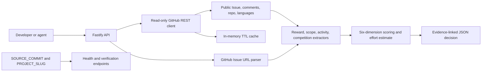
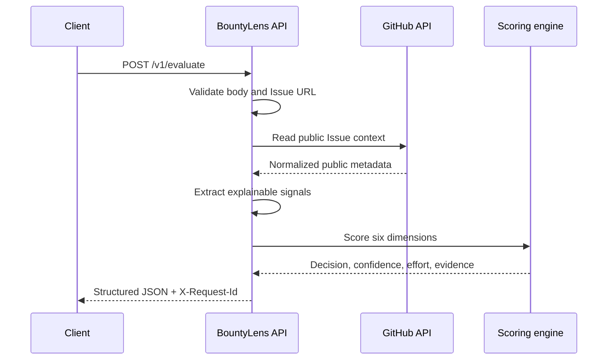

# BountyLens

> Evaluate whether a public GitHub task is worth pursuing before spending developer time or agent compute on implementation.

BountyLens turns a public GitHub Issue URL and an optional developer profile into a deterministic opportunity assessment. It reports task clarity, explicit reward evidence, repository activity, maintainer responsiveness, technical fit, competition pressure, estimated effort, supporting evidence, and a `pursue`, `investigate`, or `skip` decision.

Built for the **Open Innovation** track of the X-Agent AI MCP Hackathon 2026.

## Why it exists

Developers and coding agents can spend hours investigating a task before learning that its reward is unclear, the scope is incomplete, or several contributors are already competing for it. BountyLens moves that decision earlier and exposes the result as stable JSON that can be used directly by humans, agents, and future MCP tools.

It is intended for:

- Coding agents choosing useful work before generating code.
- Independent developers evaluating public GitHub bounties.
- Small engineering teams triaging contribution opportunities.
- Automated workflows that need evidence-backed JSON rather than an unstructured opinion.

## What the MVP does

- Accepts a public GitHub Issue URL and an optional developer profile.
- Reads public Issue, comment, repository, activity, and language data from GitHub.
- Extracts explicit reward, scope, activity, and competition signals.
- Produces six deterministic dimension scores, a total score, confidence, and an effort range.
- Returns a machine-readable `pursue`, `investigate`, or `skip` decision.
- Provides offline examples plus public health and deployment-verification endpoints.
- Uses a 300-second in-memory cache by default to reduce duplicate GitHub requests.

## Architecture





## Quick start

Requirements: Node.js 20 or newer and npm.

```bash
git clone https://github.com/bowenhb/bountylens.git
cd bountylens
npm ci
cp .env.example .env
npm run dev
```

The API starts on `http://localhost:3000` by default. A GitHub token is optional for public Issues, although adding one raises GitHub's rate limit.

Run the verification suite:

```bash
npm run typecheck
npm test
npm run build
```

Run the compiled service:

```bash
npm run build
NODE_ENV=production \
SOURCE_COMMIT=0123456789abcdef0123456789abcdef01234567 \
npm start
```

Production startup requires an explicit 40-character commit SHA and rejects the development all-zero placeholder.

## Environment variables

| Variable | Default | Purpose |
|---|---|---|
| `NODE_ENV` | `development` | `development`, `test`, or `production`. |
| `HOST` | `0.0.0.0` | Network interface used by the HTTP server. |
| `PORT` | `3000` | HTTP port from 1 to 65535. |
| `GITHUB_TOKEN` | unset | Optional server-side GitHub token. Never returned to clients. |
| `SOURCE_COMMIT` | 40 zeroes outside production | Exact reviewed Git commit shown by the status endpoints. |
| `RENDER_GIT_COMMIT` | unset | Render-provided deployed commit; used when `SOURCE_COMMIT` is absent. |
| `PROJECT_SLUG` | `bountylens` | Stable slug returned by the verification endpoint. |
| `CACHE_TTL_SECONDS` | `300` | In-memory Issue-context cache lifetime. |
| `REQUEST_TIMEOUT_MS` | `10000` | Timeout applied to each GitHub request and the Fastify server. |

Do not commit `.env`; it is excluded by `.gitignore`.

## API

The complete contract, schemas, status codes, and examples are in [openapi.yaml](./openapi.yaml).

| Method | Path | Purpose |
|---|---|---|
| `POST` | `/v1/evaluate` | Evaluate one public GitHub Issue. |
| `GET` | `/v1/examples/:exampleId` | Return a deterministic offline example. |
| `GET` | `/health` | Report liveness and the deployed source commit. |
| `GET` | `/.well-known/xagent-verification.json` | Bind the deployment slug to the same source commit. |

Every response includes an `X-Request-Id` header. Evaluation success and error bodies also include the same value as `request_id`.

### Evaluate a real public Issue

```bash
curl -sS http://localhost:3000/v1/evaluate \
  -H 'content-type: application/json' \
  -d '{
    "issue_url": "https://github.com/fastify/fastify/issues/7030",
    "developer_profile": {
      "languages": ["JavaScript", "TypeScript"],
      "hourly_rate_usd": 30,
      "max_hours": 24
    }
  }'
```

Representative response fields:

```json
{
  "request_id": "req_...",
  "decision": "investigate",
  "score": 60,
  "confidence": 0.86,
  "estimated_effort": {
    "min_hours": 13,
    "max_hours": 26,
    "confidence": 0.95
  },
  "reward": {
    "amount": null,
    "currency": null,
    "evidence": ["No explicit USD bounty or reward amount was found."]
  }
}
```

Scores may change when the public Issue or repository changes. The response includes all six dimensions, evidence, next actions, and limitations.

### Safe error example

```bash
curl -sS http://localhost:3000/v1/evaluate \
  -H 'content-type: application/json' \
  -d '{"issue_url":"https://example.com/not-a-github-issue"}'
```

```json
{
  "request_id": "req_...",
  "error": {
    "code": "INVALID_ISSUE_URL",
    "message": "Only public https://github.com issue URLs are supported.",
    "retryable": false
  }
}
```

### Offline examples

These endpoints do not call GitHub:

```bash
curl -sS http://localhost:3000/v1/examples/clear-reward-low-competition
curl -sS http://localhost:3000/v1/examples/clear-reward-high-competition
curl -sS http://localhost:3000/v1/examples/no-explicit-reward
```

### Deployment proof

```bash
curl -sS http://localhost:3000/health
curl -sS http://localhost:3000/.well-known/xagent-verification.json
```

Both responses must contain the same final 40-character `SOURCE_COMMIT`.

## Scoring

The total score is a weighted average of six independently testable dimensions:

| Dimension | Weight | Public signals |
|---|---:|---|
| Scope clarity | 25% | Acceptance criteria, reproduction steps, tests, files, and actions. |
| Reward evidence | 20% | Explicit USD amount and whether it appears in the title, body, label, or comments. |
| Repository activity | 15% | Repository update, push, and Issue update recency. |
| Maintainer responsiveness | 15% | Public maintainer replies and first-response time. |
| Technical fit | 15% | Byte-weighted overlap between repository languages and the optional profile. |
| Competition pressure | 10% | Assignees, claims, pull-request signals, and distinct competitors. |

Decision thresholds:

```text
80–100  pursue
60–79   investigate
0–59    skip
```

Missing developer languages produce a neutral technical-fit score of 50 with lower confidence. Missing data reduces confidence or uses a documented neutral value. An absent explicit reward is never replaced with a guessed amount.

The effort estimate is a coarse range based on visible scope signals such as checklist items, test requirements, file references, and action items. It is not a delivery commitment.

## Data and security

- Only public GitHub REST endpoints are read; BountyLens does not modify GitHub data.
- The optional GitHub token remains server-side and is used only in the `Authorization` header sent to GitHub.
- Validated GitHub responses are reduced to the minimum internal fields used by extraction and scoring.
- API responses do not return complete Issue bodies, comment bodies, secrets, or private upstream error messages.
- Structured logs contain request ID, route, status, duration, and safe upstream status metadata. Tests verify that bodies, profiles, credentials, and private errors are absent.
- Request bodies are limited to 16 KiB. GitHub calls use configurable timeouts and a short in-memory cache.
- The service does not execute code from the target repository.

## Limitations and non-goals

BountyLens does not:

- Guarantee that a bounty will be paid or that a contribution will be accepted.
- Perform scam detection, payment-risk scoring, wallet analysis, security auditing, or compliance analysis.
- Access private repositories or inspect uncommitted work.
- Build, test, or execute the target repository.
- Post comments, claim Issues, open pull requests, or modify external repositories.
- Provide accounts, subscriptions, payments, or a complex frontend in the hackathon MVP.

GitHub comments can be incomplete when an Issue has more than 100 comments, because the MVP reads at most the first 100. Activity and competition results reflect the public data available at evaluation time.

## Deployment

Build and run the production container:

```bash
docker build -t bountylens:local .
docker run --rm -p 3000:3000 \
  -e SOURCE_COMMIT=0123456789abcdef0123456789abcdef01234567 \
  -e PROJECT_SLUG=bountylens \
  bountylens:local
```

The final image contains production dependencies and compiled JavaScript only, runs as the unprivileged `node` user, listens on `0.0.0.0:$PORT`, and includes a `/health` container check.

### Render

The repository includes [`render.yaml`](./render.yaml) for a free Docker web service in Render's Singapore region. It configures `/health`, keeps automatic deploys off so the reviewed commit can be deployed deliberately, and uses Render's immutable `RENDER_GIT_COMMIT` metadata for the public version-proof endpoints.

Free Render web services can sleep after inactivity, so the first request after an idle period can take longer. The hosted API remains suitable for public hackathon review without committing credentials or requiring a database.

For a Node hosting platform without Docker:

1. Install dependencies with `npm ci`.
2. Build with `npm run build`.
3. Start with `npm start`.
4. Set `NODE_ENV=production`, `SOURCE_COMMIT`, and `PROJECT_SLUG=bountylens`.
5. Optionally set a server-side `GITHUB_TOKEN`.
6. Configure `/health` as the health-check path.
7. Confirm that `/health` and the verification endpoint return the same reviewed commit.

## Commercial path after the hackathon

The API can become an MCP tool that agents call before starting paid or high-value work. A commercial version could add saved developer profiles, repository-specific calibration, monitored opportunity feeds, team policies, historical outcome feedback, and usage-based API plans. Payment handling and security-risk analysis remain separate products and are outside this evaluator.

## Project status

The API, deterministic scoring engine, offline examples, health proof, tests, and documentation are implemented. Deployment packaging and the final public hosted submission remain in progress.

## License

MIT
