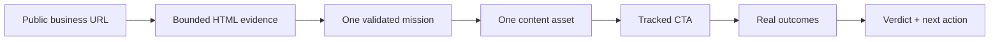

# Finfold Growth Mission API

**One URL. One evidence-bound growth move. One measurable outcome loop.**

Finfold Growth Mission turns a public business page and a growth objective into exactly one primary mission, one platform-native content asset, and one tracked CTA. Real clicks, leads, signups, purchases, and revenue feed back into a `won`, `lost`, `running`, or `inconclusive` verdict with a concrete next action.

This is a standalone Cloudflare Worker built for the X-Agent MCP Hackathon. It is not a wrapper around the private Finfold application and contains no Finfold customer data or proprietary application source.

## Why this exists

Most growth agents stop at copy generation. This capability completes a measurable operating loop:



The model selects the mission, audience, hypothesis, and evidence by stable semantic section ID. A deterministic evidence compiler preserves the selected angle, combines up to three canonical source excerpts, and gives each platform its own publishing structure. Every factual claim remains the exact textual intersection of the deliverable and its cited quote; connective language must be framed as a test or hypothesis. Invalid structure, unknown evidence IDs, unsupported numbers, missing CTA, platform overflow, or guaranteed-result language triggers one repair attempt and then a clear error—never a fabricated fallback.

## Live interfaces

- `GET /health` — status and exact deployed commit
- `GET /.well-known/xagent-verification.json` — schema version, X-Agent slug, and the same commit
- `GET /v1/capability` — product boundary, retention, side effects, and fixed per-mission price interface
- `POST /v1/missions` — create one mission (`mission:create`)
- `GET /v1/missions/{id}` — read mission, attribution, verdict, and next action (`mission:read`)
- `POST /v1/missions/{id}/outcomes` — record one idempotent outcome (`outcome:write`)
- `GET /v1/usage` — key expiry and daily usage (`mission:read`)
- `GET /r/{trackingCode}` — count an anonymous click and redirect with UTM parameters
- `POST /mcp` — stateless Streamable HTTP MCP
- `GET /openapi.json` — OpenAPI 3.1 contract

Mutation endpoints require both `Authorization: Bearer <review-key>` and `Idempotency-Key`. The review key is SHA-256 hashed at rest, scope-limited, capped at 100 authenticated calls per UTC day, and expires on 2026-10-05.

## Quick start

Requirements: Node.js 22+, a Cloudflare account, and Wrangler authentication. Production uses Cloudflare Workers AI with Llama 3.3 70B Instruct Fast for structured generation; an OpenAI-compatible HTTP adapter remains available for alternative deployments and deterministic tests.

```bash
npm ci
npx wrangler d1 create finfold-growth-mission
# Put the returned database_id in wrangler.jsonc.
npm run types
npx wrangler d1 migrations apply finfold-growth-mission --local
npm run dev
```

Production setup:

```bash
npx wrangler d1 migrations apply finfold-growth-mission --remote
node scripts/issue-review-key.mjs --remote
npx wrangler deploy --var COMMIT_SHA:$(git rev-parse HEAD)
node scripts/verify-deployment.mjs $(git rev-parse HEAD)
```

The review key command prints the raw key once after D1 accepts only its hash. Store it in an approved password manager; it cannot be recovered from D1.

## Create a real mission

```bash
curl https://api.finfold.app/v1/missions \
  -H "Authorization: Bearer $REVIEW_KEY" \
  -H "Idempotency-Key: reviewer-demo-001" \
  -H "Content-Type: application/json" \
  --data '{
    "sourceUrl": "https://www.finfold.app/",
    "objective": "leads",
    "platform": "linkedin",
    "locale": "en"
  }'
```

Then publish the returned asset manually, use its `/r/...` CTA, and record a real outcome:

```bash
curl https://api.finfold.app/v1/missions/$MISSION_ID/outcomes \
  -H "Authorization: Bearer $REVIEW_KEY" \
  -H "Idempotency-Key: crm-event-001" \
  -H "Content-Type: application/json" \
  --data '{"eventId":"crm-lead-001","type":"lead","quantity":1}'
```

For revenue missions, `targetCurrency` defaults to `USD`; every revenue outcome must use that currency. Custom landing pages must use HTTPS and the source host, its subdomain, or its canonical `www`/apex equivalent.

## Supported decisions

| Objective | Default target | Measurement window | Winning metric |
|---|---:|---:|---|
| Leads | 1 | 14 days | Recorded leads |
| Signups | 1 | 7 days | Recorded signups |
| Purchases | 1 | 30 days | Recorded purchases |
| Revenue | 1 | 30 days | Recorded revenue value |

Platforms: `auto`, `linkedin`, `x`, `reddit`, `xiaohongshu`, and `wechat`.

## Quality gates

```bash
npm run check
```

This runs lint, strict TypeScript, Worker-runtime unit/integration tests, Wrangler dry-run bundling, and a high-confidence secret scan. See [verification/README.md](verification/README.md) for the complete reproducibility procedure, the five-platform production benchmark, a redacted live mission, and authenticated MCP discovery evidence.

## Safety boundary

- Reads public HTML, metadata, and JSON-LD only; does not execute page JavaScript.
- Blocks local/private/metadata URLs, credentials, non-standard ports, unsafe redirects, oversized responses, and non-HTML MIME types. Tracked destinations must use HTTPS and stay on the source host hierarchy.
- Does not auto-publish, log into external accounts, mutate third-party accounts, or guarantee growth.
- Does not store raw HTML or raw API keys.
- Stores source evidence snippets and attributable outcome totals for 30 days. Anonymous raw clicks are reported separately and never count as credible conversion evidence on their own.

Details: [Security](docs/SECURITY.md), [Data handling](docs/DATA-HANDLING.md), [Architecture](docs/ARCHITECTURE.md), [API and MCP](docs/API.md), and [Scorecard evidence](docs/SCORECARD.md).

Support: `support@finfold.app`
