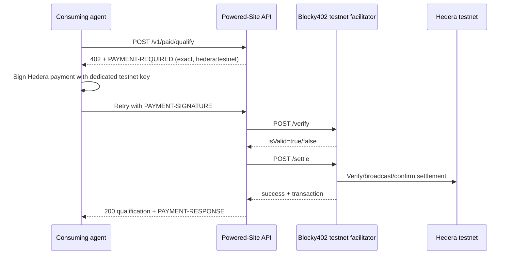

# Hedera x402 implementation and approval gate

## Current official requirements

The current ETHOnline 2026 Hedera AI & Agentic Payments bounty calls for an agent or multi-agent system that executes at least one Hedera TESTNET payment or financial operation, uses an accepted agentic/payment technology such as x402, publishes source and payment-flow documentation, and demonstrates the autonomous payment in a video of five minutes or less. This project uses Hedera testnet only.

References:

* ETHGlobal: <https://ethglobal.com/events/ethonline2026/prizes/hedera>
* x402 protocol: <https://github.com/x402-foundation/x402>
* Official Hedera x402 mechanism: <https://github.com/x402-foundation/x402/tree/main/typescript/packages/mechanisms/hedera>
* Hedera reference implementation: <https://github.com/hedera-dev/x402-hedera>
* Blocky402 API: <https://blocky402.com/docs/api-reference/>
* Blocky402 testnet guide: <https://blocky402.com/docs/quickstart/>

## Architecture



The existing unpaid `POST /v1/qualify` remains unchanged. The paid route is `POST /v1/paid/qualify`.

## Implementation status

Implemented and deployed:

* x402 v2 `402 Payment Required` response and base64 `PAYMENT-REQUIRED` header.
* Hedera `exact` / `hedera:testnet` requirements using native HBAR (`0.0.0`) by default.
* Accepts `PAYMENT-SIGNATURE` and `X-PAYMENT` payment headers.
* Remote mode posts the canonical v2 envelope to Blocky402 `/verify` and `/settle`.
* Local-only mock mode requires the explicit marker `mock: local-test-only` and performs no network or blockchain activity.
* Python protocol client for mock flow and a Node client using the official `@x402/hedera` signer path.
* Public HTTPS deployment at `https://qualifier.cryptoleaks.agency` with the final reviewed deployment commit bound by `/health` and the proof endpoint. The secure compose deployment receives that exact commit explicitly; it is not hardcoded into payment settings.
* The root page includes an unpaid x402 demo that parses the live HTTP 402 requirements and never signs or submits a payment.

The configured amount is `100000` tinybars, or `0.001 HBAR`. One real Hedera TESTNET payment proof was completed on 2026-09-12; see `evidence/hedera-real/payment-proof-redacted.json`.

## Wallet/account handling

The completed proof used two dedicated Hedera ECDSA testnet accounts:

1. Buyer/client account: signs the payment payload and pays the testnet amount/fees.
2. Seller/pay-to account: receives the payment; its account ID is `X402_PAY_TO`.

The hosted Blocky402 testnet facilitator also advertises a fee-payer account in `GET /supported`; matching `extra.feePayer` must be in the payment requirements. The service does not need the buyer private key. The buyer key is needed only by the consuming agent.

Required secrets and storage after approval:

* `HEDERA_CLIENT_PRIVATE_KEY`: buyer ECDSA testnet private key, supplied only as a protected runtime environment variable to the consuming agent; never committed or logged.
* `HEDERA_CLIENT_ACCOUNT_ID`: buyer account ID; non-secret configuration.
* `X402_PAY_TO`: seller account ID; non-secret configuration.
* `X402_FEE_PAYER`: facilitator-advertised fee payer; non-secret configuration.

The service itself does not hold a buyer private key. The key was loaded only into the local consuming-agent runtime and was not logged or written to evidence.

## Faucet and funds

Testnet HBAR from the Hedera Portal faucet is sufficient for a minimal native-HBAR proof, subject to current faucet availability and account limits. It has no intended financial value. The official Hedera x402 reference also documents a Circle testnet faucet for test USDC, but USDC requires token association; native HBAR is the simpler first proof.

No real funds should be required for a Hedera testnet proof. Blocky402 documents that its hosted testnet API is open access with no API key; mainnet API-key requirements do not apply to this testnet-only plan.

## Consuming-agent instructions

Mock-only local flow:

```bash
X402_MODE=mock X402_PAY_TO=0.0.1234 .venv/bin/python agent/consume.py examples/site-ready.json
```

Real testnet flow (completed once; do not repeat without approval):

```bash
cd agent
corepack pnpm install --frozen-lockfile
HEDERA_CLIENT_ACCOUNT_ID=0.0.x \
HEDERA_CLIENT_PRIVATE_KEY='[protected runtime value]' \
 SERVICE_URL='https://qualifier.cryptoleaks.agency/v1/paid/qualify' \
node consume.mjs ../examples/site-ready.json
```

The completed flow used a protected process environment, did not print the key, and preserved redacted request/402/sign/retry/result evidence. Do not repeat the payment proof.

## Evidence structure

```text
evidence/
├── README.md
├── local-mock/
│   ├── initial-402.json
│   ├── retry-result.json
│   └── test-log.txt
└── hedera-real/                # one real Hedera TESTNET proof; redacted only
    ├── initial-402.json
    ├── payment-response-redacted.json
    ├── qualification-result.json
    ├── transaction-id.txt
    └── run-metadata.json
```

Never store private keys, signed payloads, access tokens, or unredacted personal data in evidence.

## Bounty checklist

- [x] Existing qualification API retained.
- [x] x402 v2 payment boundary implemented.
- [x] Explicit Hedera testnet configuration.
- [x] Local mock payment flow and consuming client.
- [x] Real Hedera client path using `@x402/hedera`.
- [x] Dedicated buyer and seller testnet accounts approved and created.
- [x] Testnet HBAR obtained from faucet.
- [x] Blocky402 `GET /supported` checked immediately before run.
- [x] One real paid request settled on Hedera testnet.
- [x] Redacted transaction/payment evidence captured.
- [x] Public service deployed.
- [x] Public GitHub repository and README package finalized locally.
- [ ] Five-minute-or-less demo recorded.
- [ ] External submission authorized and completed.
