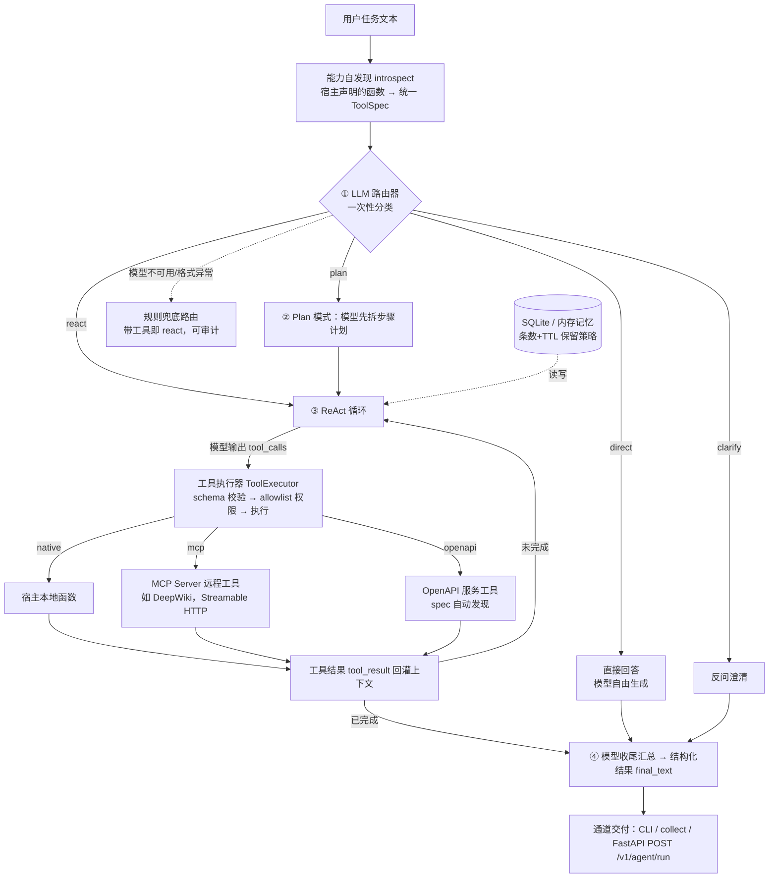

# YAI 数字员工——让现有软件零改造获得自适应 Agent 能力

> 2026 AI杭州·码动未来 AI模型智能体创新大赛｜AI+超级智能体赛道｜高校组
> 初赛创意/方案文档（v0.3，2026-09-14：v0.2 已按 Codex `40-review-hangzhou-entry.md` 完成 P1×3 + P2×5 修订；v0.3 将 §7 评审复现命令改为动作型措辞，规则/LLM 两条路由路径下均稳定命中工具调用）
> 写作纪律：本文只写仓库里可复现的事实（命令、数字、commit、线上响应），不写无法现场演示的能力。

## 0. 作品基本信息

| 项 | 内容 |
|---|---|
| 作品名 | YAI 数字员工（内核名 YAI Agent Core，发行包 `yai-agent-core`） |
| 赛道 | AI+超级智能体 |
| 组队 | 单人队，队名 **YAI**（GitHub: [Gi-Tuu](https://github.com/Gi-Tuu)）；参赛者真实姓名/学校等身份信息仅填写在报名系统，公开材料与代码仓不署真名 |
| 源码仓库 | https://github.com/Gi-Tuu/yai-agent-core |
| 在线原型 | https://yai-agent-core.onrender.com （免费 PaaS，Docker 部署） |
| 冻结 commit | `0a2634f3b13d690398c77d9119c3beecd4881929`（线上 /health 实时返回该值） |
| 模型 | DeepSeek `deepseek-chat`（OpenAI 兼容接口；模型可替换，内核不绑定厂商） |
| 主演示场景 | `examples/host_a_notes` 笔记/数据整理（办公提效） |
| 泛化佐证场景 | `examples/host_c_companion` 陪伴助手（同一内核换宿主即换岗位） |

## 1. 痛点与创意（一句话）

市面上的 Agent 产品大多是"又一个独立 Agent 应用/编排框架"：软件厂商想让自己的软件拥有 Agent 能力，仍然要自己接模型、写工具总线、写循环、写记忆、做适配。**YAI 反转了这个范式：宿主软件只负责"声明自己有什么能力"（普通业务函数 + 一行描述），YAI 内核在进程内自适应地完成意图理解、策略选择、规划、工具调用与结果交付**——宿主不写任何 Agent 代码，import 即得数字员工。

```python
# 宿主侧全部接入成本（examples/host_a_notes/run.py 同构）：
core = AgentCore.auto(capabilities, model)      # capabilities 就是普通 Python 函数的列表
result = await core.run("帮我统计一下笔记数量")   # 或 async for event in core.astream(...) 拿事件流
```

内核本体（`src/yai_core/`）**零第三方运行时硬依赖**（`pyproject.toml` 的 `dependencies = []`）；模型客户端、FastAPI 服务、MCP/OpenAPI 集成为可选 extra，按需安装。

## 2. 大模型环节全链路（评分硬要求：必须写清使用大模型的流程细节）

### 2.1 全链路图（Mermaid，GitHub 直接渲染）



### 2.2 每一次模型调用的职责（共 4 个可能的调用点）

| # | 调用点 | 输入 | 模型产出 | 失败处理 | 对应代码 |
|---|---|---|---|---|---|
| ① | **路由分类**（每个任务恰好 1 次） | 用户任务 + 全部工具的 name/description | `strategy`（direct/react/plan/clarify）、`tier`、`reason` | 模型异常或 JSON 不合规时回退**规则路由**（有工具→react，无工具→direct），事件里 `source=rules` 可审计 | `kernel/router.py` |
| ② | **计划生成**（仅 plan 策略，1 次） | 任务 + 工具清单 | 有序步骤计划，发 `plan_created` 事件 | 计划为空则降级进 ReAct | `kernel/loop.py` |
| ③ | **ReAct 推理/工具选择**（0 到 N 轮） | 历史消息 + 工具结果 | 自然语言推理或 `tool_calls`（工具名+参数） | 参数经 JSON Schema 校验，非法即报错事件，不执行 | `kernel/loop.py`、`tools/executor.py`、`tools/schema.py` |
| ④ | **收尾汇总**（1 次） | 完整工具观察链 | 面向用户的最终答复 `final_text` | —— | `kernel/loop.py` |

### 2.3 决策全程可审计：事件流实证

内核的每个自适应决策都通过**唯一事件出口** `AgentCore.astream` 以 `AgentEvent(type, data)` 流式发出，无静默决策。真实事件类型（`src/yai_core/types.py`）：

```json
[
  {"type": "strategy_selected", "data": {"strategy": "react", "source": "llm", "reason": "任务需要查询笔记", "tier": "standard"}},
  {"type": "tool_call",    "data": {"tool": "count_notes", "arguments": {}}},
  {"type": "tool_result",  "data": {"tool": "count_notes", "ok": true, "preview": "3"}},
  {"type": "model_message","data": {"text": "你一共有 3 条笔记。"}},
  {"type": "done",         "data": {"strategy": "react", "final_text": "你一共有 3 条笔记。"}}
]
```

字段口径（与源码逐行一致）：`tool_call` 为 `{tool, arguments}`；`tool_result` 为 `{tool, ok, preview|error}`，`preview` 是结果 JSON 文本的前 200 字符；`model_message` 为 `{text}`；`done` 为 `{strategy, final_text}`。

线上实测（2026-09-13，真实 DeepSeek）：原生工具任务"统计笔记数"十秒量级返回"3 条笔记"，事件链完整；MCP 任务（问 DeepWiki 上 python-sdk 的 Client 初始化）二十秒量级完成一次真实远程 MCP 工具调用并给出正确中文结论（时延含网络与免费实例冷启动波动，仅作参考）。

## 3. 五维评分逐项举证（各 20 分）

### 3.1 技术可行性（20）——已运行，不是设想

- **在线可验收**：`GET https://yai-agent-core.onrender.com/health` 实时返回 `{"status":"ok","commit":"0a2634f…"}`；`GET /v1/tools` 列出当前工具；`POST /v1/agent/run`（请求体 `{"task": "..."}`）为真实能力端点。
- **测试**：**125 项离线测试全绿**（假模型 / httpx MockTransport / 注入时钟，不依赖网络与 API Key），覆盖路由、循环、上下文压缩、记忆、保留策略、MCP 桥、OpenAPI 桥、限流、API。
- **CI**：GitHub Actions 四矩阵（Ubuntu Python 3.11/3.12/3.13 + Windows 3.13）跑 ruff + pytest，最近一次 run 成功。
- **可复现**：`uv sync --extra dev --extra llm --extra server --extra mcp --extra openapi` → `uv run pytest`（125 项全绿，命令与 CI 一致）→ `uv run python scripts/smoke_test.py`（一个内核冒烟跑通三个宿主）；`docker compose up --build` 容器化（容器内 8000）；PaaS 部署件为 `render.yaml` + `Dockerfile`。
- **生产化细节**：POST 端点每 IP 滑动窗口限流（默认 30 次/分钟，超限返回 429 + Retry-After，GET 验证端点永久放行，不触达模型不花额度）；历史保留策略（默认 200 条 / 7 天 TTL，按对话轮边界裁剪，不会拆散工具调用对）。

### 3.2 市场可行性（20）——泛用性与落地路径

- **泛用性实证**：仓库内置 4 个宿主示例——办公笔记（host_a，3 个本地工具）、数据应用（host_b）、AI 陪伴（host_c，5 个工具：档案/回忆/记忆/心情/关怀建议）、本地 MCP 演示（host_d）。**同一份内核，不改一行内核代码，换 capabilities 即换岗位**。
- **接入成本低**：宿主工具就是普通 Python 函数，类型注解 + docstring 自动转 JSON Schema（与 MCP 工具同构），无需学习新框架概念。
- **落地路线明确**：第一阶段作为独立开源内核（本作品）；第二阶段回流内嵌进开源 AI 陪伴项目 AMBRACE（https://github.com/Gi-Tuu/AMBRACE），验证真实 To C 软件内嵌路径；第三阶段经 MCP 标准化接入更大生态（X-Agent MCP Hackathon 已同步投稿，PR #56）。
- **商业模式友好**：Library-first、进程内运行，不强制托管、不抽成、不锁定模型厂商，软件厂商保留自己的数据与 UI。

### 3.3 综合创新性（20）

1. **范式创新——host-declares-capability / core-adapts**：现有框架（LangChain/CrewAI/AutoGen 等）止步于"提供积木"，仍需开发者自己组装 Agent；YAI 让**已有软件零 Agent 代码**获得能力，定位是"可内嵌的内核"而非"又一个 Agent 应用"。
2. **自适应路由可审计**：LLM 一次性输出策略决策（strategy/tier/reason），每个决策落事件流；模型不可用时有规则兜底，保证确定性退化。
3. **双协议工具发现**：同一工具注册表面对三类来源——native 函数、MCP Server（官方 python-sdk，支持 Streamable HTTP / stdio / 进程内直连三种传输）、OpenAPI spec（最小规范解析 → 工具自动桥接，测试用 MockTransport 离线验证）。
4. **内核零硬依赖 + SPI 四契约**（model/channel/memory/policy）：模型、通道、记忆、权限全部面向契约编程，宿主可逐项替换。

### 3.4 AI 大模型结合（20）——见 §2 全链路

补充事实：① 模型层为 OpenAI 兼容抽象（`llm/openai_compat.py`），DeepSeek/通义/OpenAI 仅改环境变量；② 上下文管理按轮边界压缩（`kernel/context.py`），避免长对话超窗且不切断工具调用对；③ 鼓励项"长短期记忆"已落地：SQLite 持久化（带 scope 隔离与 schema 版本钩子）+ 条数/TTL 保留；④ 鼓励项"工具调用"为核心能力，MCP 远程工具已在线真实跑通；⑤ 鼓励项"工作流编排"对应 plan 策略的显式计划事件。多智能体、多模态在路线图中（见 §6），初赛版本不宣称。

### 3.5 赛道维度（20）——任务理解/规划/工具/交付/闭环

| 赛道评分点 | 作品对应 |
|---|---|
| 模糊意图解析与任务拆解 | LLM 路由器 + plan 模式；意图不清走 clarify 反问 |
| 自主规划 | `plan_created` 事件给出有序步骤，再逐步执行 |
| 工具调用与环境交互（区别于问答机器人的关键） | Discovery 自发现 → ToolRegistry → Schema 校验 → Allowlist 权限 → Executor；native/MCP/OpenAPI 三源 |
| 结果交付与可验收性 | 结构化 RunResult（strategy/events/final_text）；FastAPI 上 POST 即得 JSON 事件序列；CLI/collect 双通道 |
| 场景价值与端到端闭环 | host_a"整理/统计笔记"全流程录屏演示；线上 curl 可现场复验 |
| 长短期记忆（鼓励项） | SQLite 持久化 + 200 条/7 天保留策略 |
| 检索增强 RAG（鼓励项） | OpenAPI/MCP 工具即外部知识入口（DeepWiki 远程查询实证）；向量检索在路线图，不冒称已具备 |

## 4. 演示场景设计（与演示视频脚本一致，详见《演示脚本.md》）

- **主场景（host_a 办公提效）**：3 条虚构笔记 + `list_notes(tag)` / `search_notes(keyword)` / `count_notes()` 三个工具，演示"统计笔记数 → 按关键词检索 → 汇总"端到端闭环，画面带事件流。
- **换岗位（host_c）**：同一内核切到陪伴宿主，工具集与策略随之变化，证明泛化。
- **能力纵深**：MCP 远程工具（DeepWiki）一次真实调用；SQLite 记忆持久化说明。
- 全部演示数据为虚构，无真实个人数据。

## 5. 技术架构（简版）

```text
宿主软件（host_a / host_c / 任意 Python 软件 / AMBRACE）
  │  声明 capabilities（普通函数）+ 选择 model/channel/memory/policy
  ▼
YAI Agent Core（进程内库，零第三方硬依赖）
  ├── discovery/introspect   能力自发现（函数 → ToolSpec）
  ├── kernel/router          ① LLM 路由（规则兜底，可审计）
  ├── kernel/context         轮边界压缩
  ├── kernel/loop            ②③④ 计划/ReAct/收尾，事件流唯一出口
  ├── tools/                 registry / executor / schema 校验
  ├── policy/allowlist       工具权限收口
  ├── memory/                inmemory + sqlite_store + retention（条数/TTL）
  ├── spi/                   model / channel / memory / policy 四契约
  ├── integrations/mcp       MCP Client（HTTP/stdio/内存）
  ├── integrations/openapi   OpenAPI spec 解析与工具桥接
  └── batteries/fastapi_server  /health /验证端点 /v1/tools /v1/agent/run + 限流中间件
```

## 6. 诚实边界（可现场说明，不回避）

- v0.1 明确**未做**：MCP Server、多智能体协作、自进化写工具、向量记忆/RAG、内置 UI、coding agent；这些在公开路线图中，初赛材料不宣称。
- 在线实例为 Render 免费层：15 分钟无流量休眠（冷启动约 30–90 秒、波动较大，已配每 10 分钟保活工作流）；本地 SQLite 随临时盘重建即清空（演示数据本为虚构，不影响评审）。
- 限流用于防误刷，不防御伪造 X-Forwarded-For（代码注释与提交材料均如实声明）。
- 无账号体系/鉴权墙：评审无需登录即可调用，反而降低验收门槛；鉴权在路线图。

## 7. 关键复现命令（评审现场可用）

```bash
# 线上（无需任何安装）
curl https://yai-agent-core.onrender.com/health
curl https://yai-agent-core.onrender.com/v1/tools
curl -X POST https://yai-agent-core.onrender.com/v1/agent/run \
  -H "Content-Type: application/json" -d '{"task":"帮我统计一下笔记总数"}'

# 离线复现（Python 3.11+，uv）
git clone https://github.com/Gi-Tuu/yai-agent-core && cd yai-agent-core
git checkout 0a2634f3b13d690398c77d9119c3beecd4881929
uv sync --extra dev --extra llm --extra server --extra mcp --extra openapi
uv run pytest                      # 125 项离线测试（命令与 CI 一致）
uv run ruff check src tests examples scripts
uv run python scripts/smoke_test.py  # 三宿主自适应冒烟
```

## 8. 附：评分→证据速查

| 维度 | 最强证据 |
|---|---|
| 技术可行性 | 线上 API + 125 测试 + CI 四矩阵 + Docker/Render 部署 |
| 市场可行性 | 4 宿主泛化实证 + 三行接入 + AMBRACE 回流路线 |
| 综合创新性 | 范式反转 + 可审计路由 + MCP/OpenAPI 双协议 + 内核零依赖 |
| AI 大模型结合 | §2 全链路图 + 4 个模型调用点职责 + 事件流实证 |
| 赛道维度 | 路由/规划/工具/交付/记忆逐项有模块与演示对应 |
